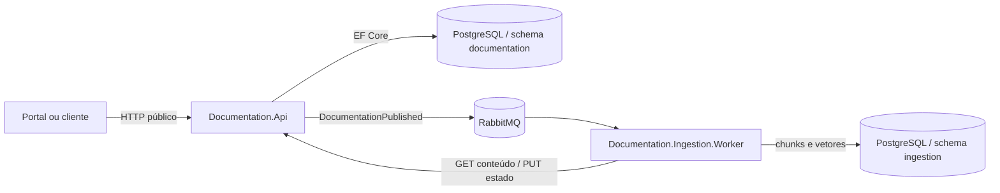

# Especificação do sistema Documentation API

## 1. Identificação

| Item | Valor |
| --- | --- |
| Executável | `Documentation.Api` |
| Tipo | API HTTP para registro e versionamento de documentações |
| Plataforma | ASP.NET Core / .NET 10 |
| Persistência | PostgreSQL via EF Core e Npgsql |
| Integração assíncrona | RabbitMQ |
| Schema proprietário | `documentation` |
| Estado desta especificação | *As built*: descreve a POC e explicita requisitos para o sistema definitivo |

## 2. Objetivo e escopo

O sistema é a fonte de verdade do cadastro de APIs, de suas versões de
documentação e do estado de publicação/indexação de cada versão. Ele preserva
o conteúdo original, publica a identidade de uma nova versão para processamento
assíncrono e oferece ao worker de ingestão o conteúdo e a atualização de estado.

É responsabilidade deste sistema:

- identificar uma documentação pelo `apiId`;
- registrar versões imutáveis por ambiente;
- persistir o conteúdo original enviado pelo cliente;
- impedir, no banco, duas versões com o mesmo documento, versão e ambiente;
- publicar e republicar referências de versões no RabbitMQ;
- expor consultas resumidas sem o conteúdo integral;
- fornecer o conteúdo integral à ingestão por uma rota interna;
- receber da ingestão os estados `indexing`, `available` e `indexingFailed`;
- propagar correlação entre HTTP, logs e mensagem AMQP;
- expor Swagger e um endpoint básico de saúde.

Não é responsabilidade da API na POC:

- interpretar ou particionar OpenAPI;
- gerar embeddings ou responder busca semântica;
- validar que o conteúdo é OpenAPI válido;
- armazenar chunks ou vetores;
- editar ou excluir documentações e versões;
- autenticar ou autorizar clientes;
- garantir atomicidade entre PostgreSQL e RabbitMQ.

## 3. Contexto no projeto



O conteúdo não trafega na mensagem. O evento contém apenas a identidade e os
metadados necessários para o worker buscar a versão na API interna.

## 4. Arquitetura e dependências

```text
Documentation.Api
  -> Documentation.Application
  -> Documentation.Infrastructure
  -> Documentation.Contracts

Documentation.Infrastructure
  -> Documentation.Application
  -> Documentation.Domain
  -> Documentation.Contracts

Documentation.Application
  -> Documentation.Domain
  -> Documentation.Contracts

Documentation.Domain
  -> nenhuma camada do sistema
```

| Projeto | Responsabilidade implementada |
| --- | --- |
| `Documentation.Domain` | Entidades `ApiDocumentation` e `DocumentationVersion`, estados e mutações de ciclo de vida. |
| `Documentation.Application` | Orquestração dos casos de uso, modelos de entrada/saída e ports de persistência e publicação. |
| `Documentation.Infrastructure` | EF Core/Npgsql, repositórios, unit of work, configuração e publisher RabbitMQ. |
| `Documentation.Contracts` | Evento de integração e nomes canônicos da topologia RabbitMQ. |
| `Documentation.Api` | Controllers, contratos HTTP, JSON, CORS, correlação, logging, Swagger, health e composição. |

`DocumentationApplicationService` é o único serviço de aplicação. Os
controllers apenas convertem HTTP em comandos/resultados; não acessam EF Core
ou RabbitMQ diretamente.

## 5. Modelo de domínio

### 5.1 `ApiDocumentation`

| Campo | Tipo | Regra atual |
| --- | --- | --- |
| `Id` | UUID | Gerado pela aplicação. |
| `ApiId` | string | Obrigatório, até 200 caracteres e único no banco. |
| `Name` | string | Obrigatório, até 300 caracteres. |
| `CreatedAtUtc` | timestamp com offset | Definido com `DateTimeOffset.UtcNow` na criação. |
| `Versions` | coleção | Relação 1:N com exclusão em cascata. |

Ao receber uma versão de um `apiId` já cadastrado, a POC reutiliza o documento
existente e **não atualiza seu `name`**. A comparação de `apiId` é a comparação
do banco configurado; a aplicação não normaliza caixa, espaços ou Unicode.

### 5.2 `DocumentationVersion`

| Campo | Tipo | Regra atual |
| --- | --- | --- |
| `Id` | UUID | Gerado pela aplicação. |
| `DocumentationId` | UUID | FK obrigatória para `ApiDocumentation`. |
| `Version` | string | Obrigatória, até 100 caracteres. |
| `Environment` | string | Obrigatório, até 100 caracteres. |
| `Format` | string | Obrigatório, até 50 caracteres; valores não são enumerados. |
| `Content` | texto | Obrigatório, sem limite explícito na aplicação. |
| `Status` | enum como string | Inicia em `Publishing`. |
| `LastError` | texto nulo | Erro mais recente de publicação ou indexação. |
| `CreatedAtUtc` | timestamp com offset | Criação da versão. |
| `PublishedAtUtc` | timestamp com offset nulo | Atualizado após confirmação do broker. |
| `IndexingUpdatedAtUtc` | timestamp com offset nulo | Atualizado ao receber estado da ingestão. |

O conteúdo não possui operação de alteração. Sua imutabilidade é uma
consequência dos casos de uso expostos, não uma restrição específica do banco.

### 5.3 Estados

Estados serializados em JSON com `camelCase`:

| Estado | Significado |
| --- | --- |
| `publishing` | Versão persistida ou republicação preparada, antes da confirmação AMQP. |
| `pendingIndexing` | Evento confirmado pelo broker; processamento ainda não reportado. |
| `indexing` | Worker informou início do processamento. |
| `available` | Worker informou conclusão. |
| `publishFailed` | Publisher lançou uma exceção; `lastError` recebe a mensagem. |
| `indexingFailed` | Worker informou falha definitiva; `lastError` recebe `error`, se enviado. |

Fluxo nominal:

```text
Publishing -> PendingIndexing -> Indexing -> Available
Publishing -> PublishFailed
Indexing -> IndexingFailed
```

O domínio impõe somente que `UpdateIndexingStatus` receba um dos três estados
da ingestão. A API atual não valida a origem da transição: qualquer versão
existente pode ser alterada diretamente para `indexing`, `available` ou
`indexingFailed`. A republicação também é aceita a partir de qualquer estado.

Efeitos das mutações:

- `MarkPublishing`: limpa `LastError` e `IndexingUpdatedAtUtc`, mas preserva
  `PublishedAtUtc` anterior;
- `MarkPendingIndexing`: define `PublishedAtUtc` e limpa `LastError`;
- `MarkPublishFailed`: altera o estado e guarda o erro, sem alterar timestamps;
- `UpdateIndexingStatus`: define `IndexingUpdatedAtUtc`; mantém erro somente em
  `IndexingFailed` e o limpa nos demais estados.

## 6. Casos de uso

### 6.1 Criar e publicar versão

1. Busca o documento pelo `apiId`.
2. Cria `ApiDocumentation` se ele não existir.
3. Verifica duplicidade de `(documentationId, version, environment)`.
4. Cria `DocumentationVersion` com estado `Publishing`.
5. Salva documento e versão em uma transação implícita do `SaveChangesAsync`.
6. Cria um novo `DocumentationPublished` e publica com confirmação do broker.
7. Em sucesso, marca a versão como `PendingIndexing`, salva e retorna `Accepted`.
8. Em exceção do publisher, marca `PublishFailed`, guarda a mensagem, salva e
   retorna `PublishFailed`.

A consulta preventiva de duplicidade melhora a resposta comum, mas a garantia
real é o índice único. Duas requisições concorrentes ainda podem atravessar a
consulta; a perdedora recebe hoje uma exceção de banco não mapeada, não `409`.

### 6.2 Republicar versão

1. Busca o documento e a versão, exigindo que a versão pertença ao documento.
2. Retorna `NotFound` se algum deles não existir.
3. Marca e salva `Publishing` antes de contatar o broker.
4. Publica um novo evento, com novo `eventId`.
5. Aplica o mesmo tratamento de sucesso ou falha da criação.

Republicar não cria uma nova versão nem altera o conteúdo. Como o `eventId` é
novo, a deduplicação por evento do worker não impede o reprocessamento desejado.

### 6.3 Listar e consultar

- a lista de documentos é ordenada por `Name` crescente;
- as versões de cada documento são ordenadas por `CreatedAtUtc` decrescente;
- consultas públicas retornam metadados e estado, nunca `Content`;
- não existe paginação, filtro ou ordenação configurável.

### 6.4 Fornecer conteúdo

A busca exige simultaneamente `documentId` existente e uma versão com
`DocumentationId` e `versionId` correspondentes. A resposta contém identidade,
formato, conteúdo, versão e ambiente. O cliente atual da ingestão desserializa
somente `format` e `content` e ignora os demais campos.

### 6.5 Atualizar estado de indexação

A rota aceita apenas `Indexing`, `Available` e `IndexingFailed`, carrega a
versão pelo par documento/versão, aplica a mutação de domínio e salva. O campo
`error` é opcional mesmo para `IndexingFailed`; o worker atual não o envia.

## 7. Convenções HTTP

- JSON de entrada e saída usa nomes `camelCase`.
- Enums JSON usam nomes em `camelCase` (`pendingIndexing`, por exemplo).
- Controllers usam `[ApiController]`; erros de binding e DataAnnotations geram
  automaticamente `400 Bad Request` no formato padrão do ASP.NET Core.
- IDs nas rotas possuem constraint `guid`.
- Swagger é exposto em `/swagger` em todos os ambientes.
- Não existe prefixo global de versão da API.

### 7.1 Correlação

Todas as rotas aceitam `X-Correlation-ID` opcional. Um valor válido:

- possui entre 1 e 128 caracteres;
- começa com caractere ASCII alfanumérico;
- nos demais caracteres, aceita ASCII alfanumérico, `.`, `_`, `:` e `-`.

Header ausente ou inválido é substituído por UUID sem hífens. O valor efetivo
sempre retorna no header de resposta, entra no escopo dos logs e é colocado no
`BasicProperties.CorrelationId` da mensagem. Headers inválidos não causam
erro HTTP; geram warning sem registrar o valor completo.

### 7.2 CORS

A policy padrão permite qualquer método e header somente para a origem exata
configurada em `PORTAL_ORIGIN`, cujo padrão é `http://localhost:3000`. Não são
habilitadas credenciais CORS.

## 8. Contratos HTTP públicos

### 8.1 `POST /api/documentations`

Cria e tenta publicar uma versão.

Body:

```json
{
  "apiId": "payments-api",
  "name": "Payments API",
  "version": "1.0.0",
  "environment": "production",
  "format": "yaml",
  "content": "openapi: 3.0.0\ninfo:\n  title: Payments API\n  version: 1.0.0"
}
```

| Campo | Validação de borda atual |
| --- | --- |
| `apiId` | Obrigatório, máximo 200. |
| `name` | Obrigatório, máximo 300. |
| `version` | Obrigatório, máximo 100. |
| `environment` | Obrigatório, máximo 100. |
| `format` | Obrigatório, máximo 50. |
| `content` | Obrigatório, sem máximo e sem parsing. |

Respostas:

| Status | Condição | Corpo |
| --- | --- | --- |
| `202 Accepted` | Broker confirmou a mensagem. | `PublishDocumentationResponse`; `status = pendingIndexing`. Inclui `Location` para o GET do documento. |
| `400 Bad Request` | Binding ou DataAnnotations falhou. | Erro padrão de validação ASP.NET Core. |
| `409 Conflict` | Mesma versão e ambiente já observados na consulta. | `message` e `documentId`. |
| `503 Service Unavailable` | Publisher falhou e o estado foi salvo. | `PublishDocumentationResponse`; `status = publishFailed`, com `error`. |

`PublishDocumentationResponse`:

```json
{
  "documentId": "a53d17ec-c8b6-4d96-b7fc-cce9bc029c10",
  "versionId": "2b653cbd-fbd8-4295-9e55-62eb655a0d46",
  "status": "pendingIndexing",
  "error": null
}
```

### 8.2 `GET /api/documentations`

Retorna `200 OK` com um array de `DocumentationSummary`. Um banco vazio retorna
`[]`.

### 8.3 `GET /api/documentations/{documentId}`

Retorna `200 OK` com `DocumentationSummary` ou `404 Not Found`.

`DocumentationSummary`:

```json
{
  "id": "a53d17ec-c8b6-4d96-b7fc-cce9bc029c10",
  "apiId": "payments-api",
  "name": "Payments API",
  "createdAtUtc": "2026-08-16T15:00:00+00:00",
  "versions": [
    {
      "id": "2b653cbd-fbd8-4295-9e55-62eb655a0d46",
      "version": "1.0.0",
      "environment": "production",
      "format": "yaml",
      "status": "available",
      "lastError": null,
      "createdAtUtc": "2026-08-16T15:00:00+00:00",
      "publishedAtUtc": "2026-08-16T15:00:01+00:00",
      "indexingUpdatedAtUtc": "2026-08-16T15:00:12+00:00"
    }
  ]
}
```

### 8.4 `POST /api/documentations/{documentId}/versions/{versionId}/republish`

Não possui body. Retorna `202`, `404` ou `503` com as mesmas semânticas e corpo
de publicação descritos na criação. Não há `409` nem restrição pelo estado atual.

## 9. Contratos HTTP internos

As rotas internas usam o mesmo listener e atualmente não possuem autenticação,
autorização ou restrição de rede implementada pela aplicação.

### 9.1 `GET /internal/documentations/{documentId}/versions/{versionId}/content`

Retorna `404` quando o documento ou a versão associada não existe. Em sucesso:

```json
{
  "documentId": "a53d17ec-c8b6-4d96-b7fc-cce9bc029c10",
  "versionId": "2b653cbd-fbd8-4295-9e55-62eb655a0d46",
  "format": "yaml",
  "content": "openapi: 3.0.0",
  "apiId": "payments-api",
  "version": "1.0.0",
  "environment": "production"
}
```

### 9.2 `PUT /internal/documentations/{documentId}/versions/{versionId}/indexing-status`

Body:

```json
{
  "status": "indexingFailed",
  "error": "descrição opcional"
}
```

| Status | Condição |
| --- | --- |
| `204 No Content` | Estado salvo. |
| `400 Bad Request` | Estado diferente de `indexing`, `available` ou `indexingFailed`. |
| `404 Not Found` | O par documento/versão não existe. |

## 10. Persistência

O `DocumentationDbContext` usa o schema padrão `documentation`.

| Tabela | Chave e índices | Conteúdo |
| --- | --- | --- |
| `api_documentations` | PK `Id`; índice único em `ApiId`. | Identidade, nome e criação do documento. |
| `documentation_versions` | PK `Id`; FK para documento; índice único em `(DocumentationId, Version, Environment)`. | Conteúdo original, formato, ambiente, estados, erros e timestamps. |

A relação é 1:N e possui `DeleteBehavior.Cascade`, embora a POC não exponha
exclusão. Os repositórios de documentos carregam todas as versões com
`Include`; o repositório de versões sempre restringe consultas por
`documentationId` e `versionId`.

No startup a API executa:

1. `CREATE SCHEMA IF NOT EXISTS documentation`;
2. `Database.EnsureCreatedAsync()`.

Não há migrations. `EnsureCreated` cria o modelo em banco vazio, mas não é um
mecanismo de evolução de schema.

### 10.1 Consistência

Existem commits separados antes e depois do publish:

```text
salvar versão Publishing
        |
        v
publicar e aguardar confirmação RabbitMQ
        |
        v
salvar PendingIndexing ou PublishFailed
```

Logo, não existe transação distribuída nem outbox. Falha entre etapas pode
deixar uma versão em `Publishing`, ou uma mensagem confirmada sem a atualização
para `PendingIndexing`. A republicação manual é o mecanismo de recuperação da
POC.

## 11. Evento e mensageria

O evento canônico pertence a `Documentation.Contracts`:

```json
{
  "eventId": "52e833f8-d8f0-4b44-a52f-463cf64242be",
  "eventType": "DocumentationPublished",
  "documentId": "a53d17ec-c8b6-4d96-b7fc-cce9bc029c10",
  "versionId": "2b653cbd-fbd8-4295-9e55-62eb655a0d46",
  "apiId": "payments-api",
  "version": "1.0.0",
  "environment": "production",
  "occurredAt": "2026-08-16T15:00:01+00:00"
}
```

| Item | Valor |
| --- | --- |
| Exchange | `documentation.events`, `topic`, durável, não auto-delete |
| Routing key | `documentation.published.v1` |
| Fila principal | `documentation.ingestion.v1`, durável |
| Formato | JSON UTF-8 com convenções web/camelCase |
| Persistência | `deliveryMode = persistent` |
| Content type | `application/json` |
| Type | `DocumentationPublished` |
| Message ID | `eventId` textual |
| Timestamp AMQP | `occurredAt` em segundos Unix |
| Confirmação | `WaitForConfirmsOrDie`, prazo de 5 segundos |

O publisher declara exchange, fila principal e binding a cada publicação,
abre conexão/canal por chamada e publica com `mandatory = false`. Retry e DLQ
são constantes compartilhadas, mas são declaradas pelo worker, não pela API.
`AutomaticRecoveryEnabled` está configurado, embora a conexão seja curta.

O confirm assegura aceitação pelo broker, não conclusão da ingestão. A entrega
é efetivamente pelo menos uma vez; consumidores devem ser idempotentes por
`eventId`. O `content` nunca deve ser adicionado ao evento sem nova decisão de
contrato.

## 12. Configuração

Ordem de precedência e padrões observados no código:

| Chave .NET | Variável de ambiente usual | Precedência / padrão |
| --- | --- | --- |
| `ConnectionStrings:Postgres` | `ConnectionStrings__Postgres` | Primeira opção. |
| `ConnectionStrings:DocumentationDb` | `ConnectionStrings__DocumentationDb` | Alias usado se `Postgres` não existir. |
| conexão default | — | `Host=localhost;Port=5432;Database=documentation_portal;Username=postgres;Password=postgres`. |
| `RabbitMq:Host` | `RabbitMq__Host` | Primeira opção; padrão `localhost`. |
| `RabbitMq:HostName` | `RabbitMq__HostName` | Alias se `Host` não existir. |
| `RabbitMq:Port` | `RabbitMq__Port` | Inteiro; inválido ou ausente vira `5672`. |
| `RabbitMq:UserName` | `RabbitMq__UserName` | Padrão `guest`. |
| `RabbitMq:Password` | `RabbitMq__Password` | Padrão `guest`. |
| `RabbitMq:VirtualHost` | `RabbitMq__VirtualHost` | Padrão `/`. |
| `PORTAL_ORIGIN` | `PORTAL_ORIGIN` | Origem CORS; padrão `http://localhost:3000`. |
| `ASPNETCORE_URLS` | `ASPNETCORE_URLS` | Container define `http://+:8080`. |

`appsettings.json` contém defaults locais de PostgreSQL, RabbitMQ e níveis de
log. O Compose sobrescreve host e credenciais para a rede de containers. Não
há validação explícita de options no startup; PostgreSQL é exercitado na
inicialização, mas RabbitMQ somente ao publicar.

## 13. Startup e operação

1. Registra controllers, JSON, Swagger, health, CORS, infraestrutura e serviço.
2. Abre escopo, cria o schema e executa `EnsureCreated`.
3. Instala middleware de correlação e logging HTTP.
4. Habilita Swagger, CORS, controllers e `/health`.
5. Escuta na porta configurada; a imagem expõe `8080`.

Falha de acesso ao PostgreSQL impede o startup. O endpoint `/health` usa apenas
o health check vazio do ASP.NET Core: ele comprova que o processo responde,
mas não testa PostgreSQL ou RabbitMQ.

## 14. Observabilidade

- providers de log padrão são removidos e substituídos por console simples;
- logs são de uma linha, com timestamp, scopes e `CorrelationId`;
- cada requisição registra método, path, status e duração;
- respostas 4xx geram warning, 5xx e exceções geram error;
- sucessos de `/health` e `/swagger` são silenciados;
- casos de uso registram IDs, versão, ambiente, formato, tamanho do conteúdo,
  etapa e resultado, sem registrar o conteúdo;
- publisher registra evento, routing key, confirmação e correlação.

Não há métricas, tracing exportado, readiness, dashboards ou alertas. A
correlação usa baggage da `Activity` corrente, sem configurar um exporter.

## 15. Requisitos derivados para o sistema definitivo

### 15.1 Funcionais a preservar

- RF-API-01: manter `apiId` como identidade externa estável do documento.
- RF-API-02: manter unicidade de versão por documento e ambiente no banco.
- RF-API-03: preservar o conteúdo original e não transportá-lo no evento.
- RF-API-04: publicar apenas depois de persistir a versão.
- RF-API-05: permitir republicação sem criar uma nova versão.
- RF-API-06: separar consulta resumida pública do acesso ao conteúdo integral.
- RF-API-07: receber os estados assíncronos da ingestão.
- RF-API-08: preservar `eventId`, `documentId` e `versionId` para idempotência e
  rastreabilidade.

### 15.2 Não funcionais e lacunas a tratar

- RNF-API-01: autenticar e autorizar rotas públicas e internas.
- RNF-API-02: proteger as rotas internas por rede e identidade de workload.
- RNF-API-03: substituir `EnsureCreated` por migrations versionadas.
- RNF-API-04: adotar outbox ou mecanismo equivalente para eliminar a janela
  banco/broker.
- RNF-API-05: mapear violações concorrentes do índice único para `409`.
- RNF-API-06: definir limites de payload e política para conteúdo sensível.
- RNF-API-07: validar formatos aceitos e a estrutura OpenAPI antes de publicar.
- RNF-API-08: definir máquina de estados e controle de concorrência se ordem de
  callbacks/republicações importar.
- RNF-API-09: adicionar paginação antes de o volume tornar `Include` de todas as
  versões inviável.
- RNF-API-10: health/readiness deve testar dependências críticas.
- RNF-API-11: não devolver mensagens brutas de infraestrutura em `error`.
- RNF-API-12: versionar HTTP e eventos com política explícita de compatibilidade.

## 16. Limites conhecidos da POC

- sem autenticação, autorização, rate limit ou HTTPS na aplicação;
- Swagger habilitado incondicionalmente;
- rotas internas compartilham o mesmo host/porta das públicas;
- validação superficial: strings e comprimentos, sem OpenAPI ou allowlist de
  `format`/`environment`;
- sem outbox, retry no publisher ou tratamento transacional entre serviços;
- conexão e canal RabbitMQ novos a cada publicação;
- sem migrations, paginação, edição, exclusão ou retenção;
- sem testes automatizados específicos dos projetos .NET da API;
- sem validação de transições, ETag ou controle otimista explícito;
- `LastError` pode conter detalhes internos e o worker não envia a causa da
  falha de indexação;
- health check não verifica dependências.

## 17. Decisões a preservar e reavaliar

### Preservar

- ownership do conteúdo e do estado pela API;
- evento pequeno, sem conteúdo, e busca posterior pela rota interna;
- IDs distintos para documento, versão e evento;
- contrato compartilhado de evento/topologia em projeto sem infraestrutura;
- constraints de unicidade no PostgreSQL;
- correlação ponta a ponta;
- republicação explícita e idempotência do consumidor.

### Reavaliar antes da produção

- outbox e semântica exata de entrega;
- estados permitidos e comportamento diante de eventos/callbacks fora de ordem;
- atualização ou imutabilidade de `name` para `apiId` existente;
- normalização e sensibilidade a caixa de `apiId`, versão e ambiente;
- versionamento de API/evento e envelope de erro;
- persistência/limpeza de `PublishedAtUtc` ao republicar;
- DTO interno compartilhado versus contrato OpenAPI gerado;
- estratégia de conexão RabbitMQ e ownership da declaração da topologia;
- autorização, limites, retenção e tratamento de conteúdo sensível;
- migrations, probes de dependência, métricas e tracing distribuído.
