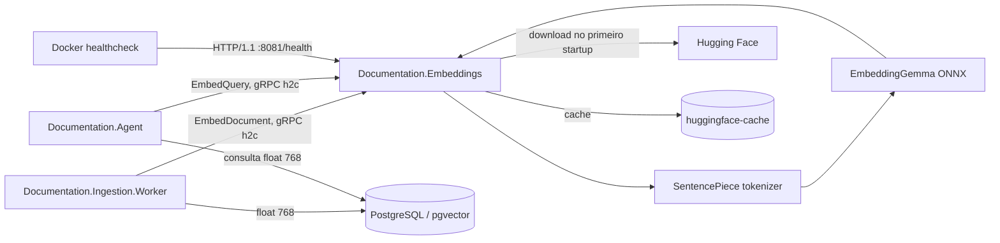
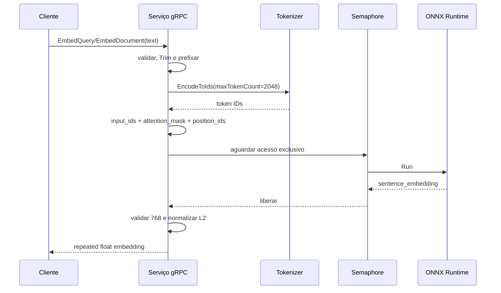

# Especificação do serviço de embeddings

## 1. Identificação

| Item | Valor |
| --- | --- |
| Serviço executável | `Documentation.Embeddings` |
| Tipo | Servidor gRPC stateless de inferência local |
| Plataforma | .NET 10, ASP.NET Core, ONNX Runtime e Microsoft.ML.Tokenizers |
| Modelo | `onnx-community/embeddinggemma-300m-ONNX` |
| Revisão | `75a84c732f1884df76bec365346230e32f582c82` |
| Saída | Vetor `float[768]` normalizado por L2 |
| Estado desta especificação | *As built*, com requisitos separados para o sistema definitivo |

## 2. Objetivo e escopo

O serviço converte texto de consulta ou de documento em vetores compatíveis para
busca por similaridade. O modelo e o tokenizer rodam localmente em CPU; não há
chamada de inferência para uma API externa. A rede só é necessária no primeiro
startup de um cache vazio, quando três artefatos fixados por revisão são baixados
do Hugging Face.

O serviço é responsável por:

- carregar e manter uma sessão ONNX compartilhada;
- aplicar prefixos diferentes para consulta e documento;
- tokenizar, executar a inferência e normalizar a saída;
- validar entrada, dimensão e norma do vetor;
- expor as RPCs `EmbedQuery` e `EmbedDocument`;
- propagar correlation ID para logs estruturados;
- informar prontidão do modelo por health check;
- conservar artefatos do modelo no diretório configurado.

O serviço não é responsável por:

- particionar OpenAPI ou escolher os trechos de contexto;
- persistir embeddings ou pesquisar o pgvector;
- versionar os vetores já armazenados;
- executar LLMs ou gerar respostas;
- autenticar clientes, aplicar quotas ou cobrar uso;
- repetir chamadas que falharam;
- administrar o ciclo de reindexação após mudança do modelo.

## 3. Contexto arquitetural



Os dois clientes devem usar o mesmo serviço, modelo, revisão, prefixos,
tokenização, dimensão e normalização. Caso contrário, os vetores de consulta e
documento deixam de pertencer ao mesmo espaço semântico.

Documentos relacionados:

- [documentation-ingestion.md](documentation-ingestion.md): geração e
  persistência dos vetores de documentos;
- [local-infrastructure.md](local-infrastructure.md): rede, volume, healthcheck
  e ordem de subida no Compose.

## 4. Organização interna

A POC concentra a implementação em `Program.cs`:

| Componente | Responsabilidade | Lifetime |
| --- | --- | --- |
| `EmbeddingGrpcService` | Adaptador gRPC, validação, prefixo, correlação e tradução de erros. | Por chamada conforme o servidor gRPC |
| `EmbeddingEngine` | Download, tokenizer, sessão ONNX, inferência e normalização. | Singleton |
| `ModelInitializer` | Carregar e validar o modelo antes de o host concluir o startup. | Hosted service |
| `ModelHealthCheck` | Reportar `Healthy` somente quando `IsReady` for verdadeiro. | Registrado no health framework |

Não há camadas ou abstrações adicionais porque o serviço possui uma única
implementação. O arquivo `.proto` é a fonte do contrato e gera o servidor C#;
o mesmo arquivo é ligado ao projeto de infraestrutura da ingestão para gerar o
cliente .NET. O Agent usa stubs Python gerados equivalentes.

## 5. Interfaces de rede

| Porta | Protocolo | Interface | Exposição no Compose |
| --- | --- | --- | --- |
| `8080` | HTTP/2 sem TLS | gRPC | Somente rede interna (`expose`) |
| `8081` | HTTP/1.1 sem TLS | `GET /health` | Somente rede interna (`expose`) |

As portas e os protocolos são fixados no código. Não há endpoint REST para
inferência, gRPC reflection nem porta publicada no host pelo Compose.

## 6. Contrato gRPC

```protobuf
syntax = "proto3";

package documentation.embeddings;

service EmbeddingService {
  rpc EmbedQuery(EmbedRequest) returns (EmbedResponse);
  rpc EmbedDocument(EmbedRequest) returns (EmbedResponse);
}

message EmbedRequest { string text = 1; }
message EmbedResponse { repeated float embedding = 1; }
```

### 6.1 Semântica das operações

| RPC | Consumidor atual | Transformação antes da tokenização |
| --- | --- | --- |
| `EmbedQuery` | `Documentation.Agent` | `task: search result \| query: {texto}` |
| `EmbedDocument` | `Documentation.Ingestion.Worker` | `title: none \| text: {texto}` |

O texto é validado e depois recebe `Trim()`. Os prefixos são parte do contrato
semântico do modelo e não são enviados pelos clientes.

### 6.2 Validação de entrada

A chamada é rejeitada com gRPC `InvalidArgument` quando:

- `text` é nulo, vazio ou contém somente whitespace;
- o comprimento original excede 200.000 caracteres .NET.

Não há mínimo de conteúdo além de um caractere não vazio, nem limite explícito
por bytes. O limite de 200.000 caracteres não impede truncamento posterior pelo
tokenizer.

### 6.3 Resposta e invariantes

Em sucesso, `embedding` deve:

- conter exatamente 768 floats;
- conter valores finitos;
- possuir norma L2 aproximadamente igual a 1;
- ter sido calculado com o prefixo correspondente à RPC.

Os clientes validam a dimensão. O Agent também valida que todos os valores são
finitos; a ingestão depende das validações e normalização do servidor para isso.

### 6.4 Metadata de correlação

O servidor procura `x-correlation-id`. O valor é aceito somente quando existe
exatamente uma ocorrência e:

- possui de 1 a 128 caracteres;
- começa com letra ou número ASCII;
- contém apenas letras, números, `-`, `_`, `.` ou `:`.

Ausência, duplicidade ou valor inválido gera um UUID local sem hífens. O valor
final entra no escopo de log, mas não volta na resposta gRPC.

## 7. Inicialização e estado

### 7.1 Artefatos

O repositório remoto é fixado no código em:

```text
https://huggingface.co/onnx-community/embeddinggemma-300m-ONNX/resolve/
75a84c732f1884df76bec365346230e32f582c82/
```

São necessários:

| Origem | Arquivo local |
| --- | --- |
| `onnx/model.onnx` | `model.onnx` |
| `onnx/model.onnx_data` | `model.onnx_data` |
| `tokenizer.model` | `tokenizer.model` |

O diretório é criado quando necessário. Cada download usa um arquivo temporário
com UUID e só depois o move para o nome final. Se o arquivo final já existir,
ele é aceito sem novo download, checksum, tamanho ou validação de revisão.

### 7.2 Sequência de startup

1. Registrar gRPC, engine singleton, hosted service e health check.
2. Criar o diretório do modelo.
3. Localizar no cache ou baixar os três artefatos, sequencialmente.
4. Criar `InferenceSession` com `model.onnx`.
5. Abrir `tokenizer.model` e criar o SentencePiece tokenizer com BOS/EOS.
6. Executar uma consulta `probe` real.
7. Exigir 768 dimensões para o probe.
8. Definir `IsReady = true` e concluir o startup.

`ModelInitializer.StartAsync` bloqueia a conclusão do startup. Falha de
download, leitura, modelo, input ONNX ou probe encerra a inicialização do host;
o Compose o reinicia por `restart: unless-stopped`.

### 7.3 Estado mantido

- persistente: somente os três arquivos no `MODEL_DIR`;
- em memória: `InferenceSession`, tokenizer, semaphore e flag `IsReady`;
- inexistente: banco, cache de respostas, sessão por usuário ou idempotency key.

Repetir uma RPC é seguro do ponto de vista de estado: ela apenas recalcula o
vetor. A POC não promete determinismo bit a bit entre runtimes ou hardware.

## 8. Pipeline de inferência



### 8.1 Tokenização

- tokenizer SentencePiece;
- BOS e EOS solicitados;
- máximo de 2.048 tokens;
- texto que excede esse orçamento é truncado pelo tokenizer;
- a contagem efetiva de tokens é registrada em log.

O serviço não informa ao cliente que houve truncamento e não devolve a contagem
de tokens. Portanto, aceitar até 200.000 caracteres não significa representar
todo o texto no vetor.

### 8.2 Tensores ONNX

Todos os tensores têm batch 1:

- `input_ids`: IDs do tokenizer, shape `[1, tokenCount]`;
- `attention_mask`: valor `1` em todas as posições;
- `position_ids`: sequência de `0` a `tokenCount - 1`, quando solicitada.

O engine percorre os nomes declarados pelo modelo e aceita apenas `input_ids`,
`attention_mask` e `position_ids`. Qualquer novo input obrigatório torna o
modelo incompatível e falha a chamada ou o probe de startup. A saída esperada
deve se chamar exatamente `sentence_embedding`.

### 8.3 Normalização

O vetor de saída é convertido em array, deve possuir 768 elementos e tem sua
norma calculada por `sqrt(sum(x²))`. Norma zero ou não finita é inválida. Cada
posição é dividida pela norma antes da resposta, tornando o produto vetorial
compatível com busca por cosseno no pgvector.

## 9. Concorrência, cancelamento e capacidade

Um `SemaphoreSlim(1, 1)` global permite somente uma inferência ONNX por instância.
Tokenização e criação dos tensores acontecem antes do semaphore e podem ocorrer
em paralelo; as execuções de `_session.Run` são serializadas.

Consequências da POC:

- não há batch nem streaming;
- não há fila limitada além dos pedidos aguardando o semaphore;
- consultas do Agent e documentos da ingestão disputam a mesma capacidade;
- cancelamento funciona enquanto a chamada espera o semaphore;
- a execução síncrona de ONNX já iniciada não recebe o cancellation token;
- escalar horizontalmente cria uma sessão e uma cópia do modelo em memória por
  réplica;
- o Compose não define limites ou reservas de CPU e memória.

O deadline é responsabilidade dos clientes atuais: ambos usam 100 segundos por
RPC. O servidor não configura deadline próprio.

## 10. Erros e retries

| Falha | Resultado observado |
| --- | --- |
| Entrada vazia ou maior que 200.000 caracteres | gRPC `InvalidArgument` |
| Dimensão, norma ou saída inválida detectada no engine | gRPC `InvalidArgument` |
| Cancelamento da chamada | cancelamento propagado pelo gRPC |
| Falha de download ou probe | startup falha |
| Modelo não inicializado | falha interna; no fluxo normal o servidor ainda não iniciou |
| Input/output ONNX incompatível ou outra exceção | erro gRPC não especializado, normalmente `Unknown` |

O servidor não executa retry. O cliente de ingestão transforma
`InvalidArgument` em falha permanente e os demais erros gRPC em falha
recuperável pela política RabbitMQ. O Agent transforma erro gRPC, dimensão
incorreta ou valor não finito em `EmbeddingUnavailable`.

Não há circuit breaker. Repetições são seguras quanto ao estado, mas consomem
novamente CPU e podem aumentar a fila interna.

## 11. Configuração e empacotamento

### 11.1 Configuração efetiva

| Item | Valor atual | Forma de alteração |
| --- | --- | --- |
| Diretório do modelo | `/models/huggingface` | `MODEL_DIR` |
| Porta gRPC | `8080`, HTTP/2 | Alteração de código |
| Porta de health | `8081`, HTTP/1 | Alteração de código |
| Revisão/repositório | Fixos no código | Alteração de código e reindexação |
| Máximo de tokens | `2048` | Alteração de código e avaliação |
| Dimensão | `768` | Contrato fixo e schema pgvector |
| Concorrência ONNX | `1` | Alteração de código e teste de capacidade |

Não há `appsettings.json` próprio. Configurações usuais do host .NET ainda podem
ser fornecidas pelo ambiente, mas as decisões acima estão explicitamente fixadas
pela implementação.

### 11.2 Container local

O Dockerfile faz publish multi-stage sobre imagens .NET 10, instala `curl` na
imagem final para o healthcheck, expõe `8080` e `8081` e executa
`Documentation.Embeddings.dll`.

No Compose:

- `MODEL_DIR=/models/huggingface`;
- volume nomeado `huggingface-cache` montado nesse caminho;
- nenhuma porta publicada no host;
- restart `unless-stopped`;
- healthcheck em `http://localhost:8081/health`;
- intervalo e timeout de 10 segundos, 18 tentativas e `start_period` de 10 min;
- Agent e worker aguardam o serviço ficar saudável.

Apagar o volume força download completo no próximo startup.

## 12. Saúde e observabilidade

### 12.1 Health

`GET /health` inclui o check `model`:

- `Healthy` quando `IsReady` é verdadeiro;
- `Unhealthy` com a mensagem `Model is still initializing.` caso contrário.

Como o hosted service bloqueia o startup até o probe terminar, em operação
normal o endpoint só passa a responder depois de o modelo estar pronto. Falhas
de inicialização tendem a derrubar o processo em vez de expor `Unhealthy`.
Liveness e readiness não são endpoints separados.

### 12.2 Logs

O console usa uma linha por evento, timestamp e scopes. São registrados:

- início, cache/download e duração da inicialização;
- artefato por nome, sem registrar URL completa nem conteúdo;
- método RPC e correlation ID;
- quantidade de caracteres e tokens, nunca o texto;
- início, duração, resultado e dimensão da inferência;
- rejeição, cancelamento e exceção.

O smoke test confirma que correlation IDs da ingestão e do Agent aparecem nos
logs e que um marcador sensível do documento não aparece. Não há métricas,
tracing distribuído, exporter OpenTelemetry, dashboard ou alertas.

## 13. Self-check e verificação

O argumento `--self-check` inicializa o engine, executa e encerra sem abrir o
servidor. Ele verifica:

1. embedding de consulta com 768 valores finitos e norma L2 próxima de 1;
2. embedding de documento com as mesmas invariantes;
3. diferença entre os vetores de consulta e documento para o mesmo texto;
4. entrada com mais de 2.048 tokens sem quebrar a inferência;
5. rejeição de whitespace e de 200.001 caracteres.

Exemplo local:

```bash
dotnet run --project src/Documentation.Embeddings -- --self-check
```

O smoke test do repositório cobre o fluxo completo: gera vetores de documento,
exige dimensão 768, gera vetor de consulta indiretamente pelo Agent e valida a
correlação sem vazamento do conteúdo em logs.

## 14. Segurança e dados

Na POC:

- gRPC e health usam texto claro;
- não há autenticação, autorização, allowlist ou rate limit;
- qualquer container na rede pode solicitar inferência;
- o texto transita em memória e pela rede interna, mas não é persistido nem
  registrado pelo serviço;
- os artefatos são baixados por HTTPS de revisão fixada, sem checksum local;
- o cache é gravável pelo processo e aceito apenas pela existência do arquivo;
- não há assinatura/SBOM específica do modelo, auditoria de requisições ou
  política de retenção de logs.

O serviço deve permanecer em rede confiável enquanto essas condições existirem.

## 15. Compatibilidade e reindexação

Os seguintes itens formam uma única versão lógica do embedding:

```text
modelo + revisão + tokenizer + prefixo + limite de tokens + pooling/saída
+ normalização + dimensão
```

Alterar qualquer item pode tornar vetores novos incomparáveis com os já
persistidos, mesmo quando a dimensão continuar 768. A POC não persiste essa
versão lógica. O worker só detecta incompatibilidade de dimensão e, nesse caso,
trunca globalmente chunks e eventos processados, marca versões afetadas como
`IndexingFailed` e exige republicação.

Para uma troca de modelo segura, o sistema definitivo deve suportar índice
paralelo ou reindexação controlada, validar qualidade antes do corte e mudar
consulta e documentos de forma coordenada.

## 16. Limites e decisões da POC

- modelo, revisão, prefixos, dimensão, portas e limite de tokens fixos no código;
- inferência CPU e serializada por instância;
- batch sempre igual a 1;
- truncamento silencioso após 2.048 tokens;
- limite de caracteres muito maior que o contexto efetivo do modelo;
- nenhum cache de respostas ou deduplicação;
- downloads sem retry, checksum ou limpeza de temporários abandonados;
- arquivos existentes aceitos sem verificação;
- ausência de TLS, autenticação, quotas e isolamento entre consumidores;
- health único e dependente do startup bloqueante;
- cancellation token não interrompe `_session.Run` já iniciado;
- sem métricas de fila, uso de CPU/memória ou taxa de truncamento;
- sem testes de contrato externos, carga, concorrência ou qualidade semântica;
- alteração de compatibilidade depende de reindexação coordenada fora do serviço.

## 17. Requisitos para o sistema definitivo

### 17.1 Contrato e qualidade

- versionar protobuf e política de compatibilidade;
- registrar e expor versão lógica do embedding e dimensão;
- manter corpus de avaliação, métricas de relevância e limiares de regressão;
- decidir limite de texto a partir do tokenizer e sinalizar truncamento;
- avaliar suporte a título real, idioma e batch com base em qualidade e carga;
- devolver erros gRPC estáveis e documentados, sem depender de `Unknown`.

### 17.2 Modelo e supply chain

- empacotar ou baixar artefatos com checksum/assinatura e origem auditável;
- validar todos os arquivos antes de aceitá-los no cache;
- limpar download parcial e implementar retry com backoff para bootstrap;
- registrar licença, SBOM, revisão e processo de aprovação do modelo;
- definir rollout, rollback e reindexação sem truncamento destrutivo.

### 17.3 Operação e escala

- separar liveness de readiness e incluir probe real controlado;
- definir limites de CPU, memória, fila, tamanho de mensagem e concorrência;
- medir antes de escolher paralelismo, batch, acelerador ou autoscaling;
- isolar capacidade de consulta e ingestão quando os SLOs exigirem;
- respeitar cancelamento/deadline durante inferência ou limitar seu impacto;
- publicar métricas de latência, espera, tokens, truncamento, erros, saturação e
  inicialização; exportar traces sem conteúdo sensível;
- testar cold start, cache corrompido, indisponibilidade remota, carga e shutdown.

### 17.4 Segurança e privacidade

- usar TLS/mTLS e autenticar cada workload;
- autorizar consumidores e aplicar quotas/rate limits;
- limitar e validar mensagens antes da tokenização;
- proteger o volume e executar o container como usuário sem privilégios;
- definir classificação, retenção e redaction para texto e metadados;
- impedir que payloads, vetores e dados pessoais entrem em logs ou traces.

## 18. Critérios de aceitação

Uma implementação compatível com a POC deve satisfazer:

1. Ambas as RPCs aceitam texto válido e retornam exatamente 768 floats.
2. Todos os vetores são finitos e têm norma L2 próxima de 1.
3. O mesmo texto usa prefixos distintos em query e document.
4. Entrada vazia ou maior que 200.000 caracteres retorna `InvalidArgument`.
5. Textos acima de 2.048 tokens não excedem o contexto do modelo.
6. O serviço só fica saudável depois de carregar e testar o modelo.
7. Cache preenchido evita novo download por existência dos arquivos.
8. Apenas uma inferência ONNX ocorre por vez em cada instância.
9. Correlation ID válido aparece nos logs; texto de entrada não aparece.
10. Worker e Agent conseguem consumir o mesmo contrato e validar 768 dimensões.
11. O modo `--self-check` conclui com código zero para um modelo válido.

## 19. Rastreabilidade no código

| Assunto | Fonte principal |
| --- | --- |
| Host, portas, RPCs, engine, health e self-check | `src/Documentation.Embeddings/Program.cs` |
| Contrato protobuf | `src/Documentation.Embeddings/Protos/embeddings.proto` |
| Dependências e geração do servidor | `src/Documentation.Embeddings/Documentation.Embeddings.csproj` |
| Container | `src/Documentation.Embeddings/Dockerfile` |
| Cliente de documentos | `src/Documentation.Ingestion.Infrastructure/Embeddings/EmbeddingGemmaEmbeddingGenerator.cs` |
| Cliente de consultas | `src/Documentation.Agent/documentation_agent/infrastructure/embeddings.py` |
| Rede, volume e healthcheck | `compose.yaml` |
| Verificação ponta a ponta | `scripts/smoke.sh` |
