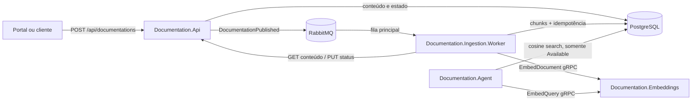
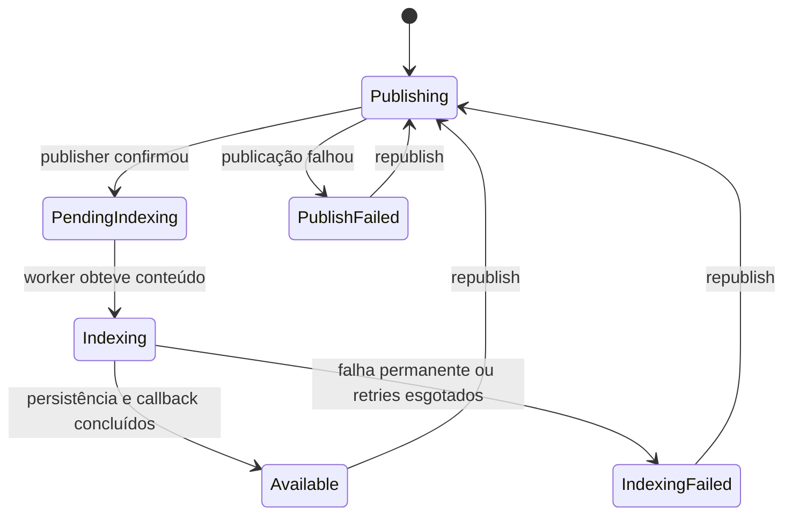
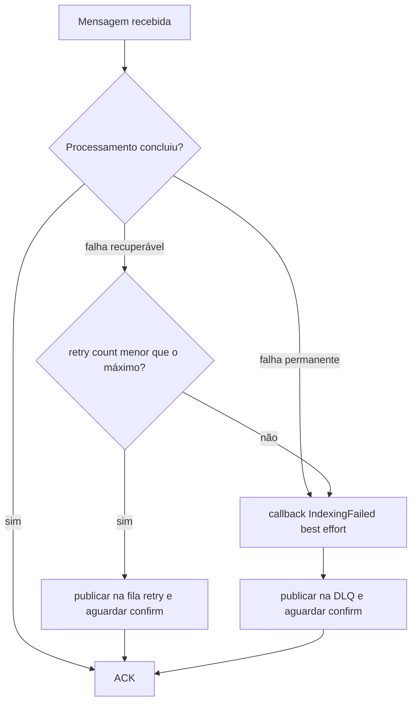

# Especificação do serviço de ingestão de documentações

## 1. Identificação

| Item | Valor |
| --- | --- |
| Serviço executável | `Documentation.Ingestion.Worker` |
| Tipo | Worker assíncrono orientado a eventos |
| Plataforma | .NET 10 |
| Entrada | Evento RabbitMQ `DocumentationPublished` |
| Saída principal | Chunks OpenAPI e embeddings no PostgreSQL/pgvector |
| Schema de dados | `ingestion` |
| Estado desta especificação | *As built*: descreve o comportamento implementado na POC |

## 2. Objetivo e escopo

O serviço transforma uma versão imutável de uma documentação OpenAPI em uma
base vetorial pesquisável. A mensagem recebida contém somente a identidade da
versão; o conteúdo é obtido da API interna, particionado por documento e por
operação HTTP, convertido em embeddings e persistido no PostgreSQL.

O serviço é responsável por:

- consumir e validar eventos `DocumentationPublished`;
- controlar ACK, retry e DLQ no RabbitMQ;
- deduplicar eventos pelo `eventId`;
- recuperar o conteúdo original pela `Documentation.Api`;
- comunicar o estado da indexação à API;
- interpretar OpenAPI em JSON ou YAML;
- produzir chunks de documento e de operação;
- solicitar embeddings de documento ao `Documentation.Embeddings`;
- substituir atomicamente os chunks de uma versão;
- registrar correlação, etapas, resultados e duração em logs;
- inicializar o schema e o índice vetorial necessários à POC.

O serviço não é responsável por:

- cadastrar, versionar ou editar documentações;
- validar integralmente a conformidade com OpenAPI;
- responder consultas semânticas;
- executar modelos de linguagem;
- expor API HTTP ou endpoint próprio de saúde;
- remover conteúdo sensível antes da indexação;
- autenticar chamadas internas na configuração atual.

## 3. Contexto arquitetural



O PostgreSQL é compartilhado fisicamente, mas os dados têm ownership lógico
separado:

- schema `documentation`: API, versões, conteúdo original e estado;
- schema `ingestion`: worker, chunks, embeddings e eventos processados.

O worker lê o conteúdo e altera o estado apenas pela API interna durante o
processamento normal. A única exceção é a migração de dimensão vetorial no
startup, que atualiza diretamente versões afetadas no schema `documentation`.

## 4. Organização em camadas

As dependências seguem a direção de Clean Architecture:

```text
Documentation.Ingestion.Worker
    -> Documentation.Ingestion.Infrastructure
        -> Documentation.Ingestion.Application
            -> Documentation.Ingestion.Domain

Documentation.Ingestion.Worker
    -> Documentation.Contracts
Documentation.Ingestion.Infrastructure
    -> Documentation.Contracts
```

### 4.1 Domain

Projeto: `Documentation.Ingestion.Domain`.

Não depende de infraestrutura. Contém:

| Elemento | Responsabilidade |
| --- | --- |
| `DocumentChunk` | Entidade persistida, com identidade, conteúdo, hash, metadados, embedding e data de criação. |
| `ProcessedIntegrationEvent` | Marca um `eventId` concluído para deduplicação. |
| `DocumentChunkDraft` | Resultado ainda sem embedding produzido pelo chunker. |

Ao criar um `DocumentChunk`, o domínio:

1. gera um novo UUID;
2. calcula `SHA-256` sobre os bytes UTF-8 do conteúdo;
3. armazena o hash em hexadecimal maiúsculo com 64 caracteres;
4. registra `CreatedAtUtc` com o relógio UTC da aplicação.

### 4.2 Application

Projeto: `Documentation.Ingestion.Application`.

Orquestra o caso de uso sem conhecer HTTP, gRPC, RabbitMQ, EF Core ou pgvector.
Seus ports são:

| Port | Contrato |
| --- | --- |
| `IIngestionService` | Processar um evento e reportar falha definitiva. |
| `IDocumentationApiClient` | Obter conteúdo e atualizar o estado da versão. |
| `IOpenApiChunker` | Transformar o conteúdo em drafts. |
| `IEmbeddingGenerator` | Gerar um vetor para cada conteúdo. |
| `IChunkRepository` | Substituir os chunks de uma versão. |
| `IProcessedIntegrationEventRepository` | Consultar e registrar idempotência. |
| `IIngestionUnitOfWork` | Executar persistência em uma transação. |

`DocumentationIngestionService` implementa a orquestração. A exceção
`PermanentIngestionException` diferencia falhas não recuperáveis das demais
falhas, que seguem a política de retry do consumidor.

### 4.3 Infrastructure

Projeto: `Documentation.Ingestion.Infrastructure`.

Implementa os ports da Application:

| Área | Implementação | Tecnologia |
| --- | --- | --- |
| Conteúdo e status | `DocumentationApiClient` | HTTP/JSON |
| Chunking | `OpenApiChunker` | `System.Text.Json` e YamlDotNet |
| Embeddings | `EmbeddingGemmaEmbeddingGenerator` | gRPC |
| Persistência | `IngestionDbContext` e repositórios | EF Core, Npgsql e pgvector |
| Transação | `IngestionUnitOfWork` | Transação PostgreSQL |
| Bootstrap de dados | `DatabaseInitializer` | SQL idempotente |
| Composição | `DependencyInjection` | DI nativa do .NET |

Tempos de vida relevantes:

- `IOpenApiChunker`: singleton e sem estado mutável por requisição;
- `DatabaseInitializer`: singleton;
- DbContext, repositórios, unit of work, serviço de ingestão e gerador gRPC:
  scoped, um escopo por entrega;
- `NpgsqlDataSource`: singleton;
- clientes HTTP e gRPC: gerenciados pelas factories do .NET.

### 4.4 Worker

Projeto: `Documentation.Ingestion.Worker`.

É a camada de entrada e composição. Contém dois hosted services, registrados
nesta ordem:

1. `DatabaseInitializationHostedService`, que prepara o banco;
2. `RabbitMqIngestionWorker`, que declara a topologia e inicia o consumo.

O worker não possui controllers nem servidor HTTP. O processo é considerado
operante pelos logs e pelo estado do container; não há healthcheck específico
no Compose.

### 4.5 Contratos compartilhados

Projeto: `Documentation.Contracts`.

Centraliza o record `DocumentationPublished` e os nomes da topologia RabbitMQ,
evitando duplicação entre publisher e consumidor.

## 5. Dependências externas

| Dependência | Uso | Protocolo | Comportamento relevante |
| --- | --- | --- | --- |
| RabbitMQ | Recepção, retry e DLQ | AMQP 0-9-1 | Mensagens duráveis, ACK manual e publisher confirms. |
| Documentation.Api | Conteúdo imutável e status | HTTP/JSON | Rotas internas sem autenticação na POC. |
| Documentation.Embeddings | Vetor de cada chunk | gRPC/HTTP2 | `EmbedDocument`, prazo de 100 s, 768 dimensões. |
| PostgreSQL + pgvector | Chunks e idempotência | Npgsql | Transação local, JSONB, `vector(768)` e HNSW. |

## 6. Contrato de entrada

### 6.1 Evento `DocumentationPublished`

O JSON usa camelCase.

| Campo | Tipo | Uso pelo worker |
| --- | --- | --- |
| `eventId` | UUID | Chave de idempotência. |
| `eventType` | string | Deve ser exatamente `DocumentationPublished`. |
| `documentId` | UUID | Identifica o documento na API e nos chunks. |
| `versionId` | UUID | Identifica a versão na API e nos chunks. |
| `apiId` | string | Metadado do evento; não participa do processamento atual. |
| `version` | string | Metadado do evento; não participa do processamento atual. |
| `environment` | string | Metadado do evento; não participa do processamento atual. |
| `occurredAt` | timestamp ISO-8601 | Auditoria do evento; não define ordenação no consumidor. |

Exemplo:

```json
{
  "eventId": "52e833f8-d8f0-4b44-a52f-463cf64242be",
  "eventType": "DocumentationPublished",
  "documentId": "a53d17ec-c8b6-4d96-b7fc-cce9bc029c10",
  "versionId": "2b653cbd-fbd8-4295-9e55-62eb655a0d46",
  "apiId": "payments-api",
  "version": "1.0.0",
  "environment": "production",
  "occurredAt": "2026-08-16T15:00:00Z"
}
```

### 6.2 Topologia RabbitMQ

| Item | Valor |
| --- | --- |
| Exchange | `documentation.events`, tipo `topic`, durável |
| Routing key | `documentation.published.v1` |
| Fila principal | `documentation.ingestion.v1`, durável |
| Fila de retry | `documentation.ingestion.retry.v1`, durável |
| Fila DLQ | `documentation.ingestion.dlq.v1`, durável |
| Prefetch | 1 mensagem por consumidor |
| ACK | Manual |
| Header de tentativa | `x-retry-count` |
| Mensagens republicadas | Persistentes, `application/json` |

A fila de retry tem TTL configurável. Ao expirar, o RabbitMQ envia a mensagem
ao exchange `documentation.events` com a routing key
`documentation.published.v1`, retornando-a à fila principal. Retry e DLQ são
publicados diretamente pelo default exchange usando o nome da fila como routing
key.

## 7. Controle de execução

### 7.1 Startup

1. O host carrega configuração e logging de console em linha única.
2. A composição valida a connection string e exige
   `Embeddings:Dimensions = 768`.
3. O inicializador tenta preparar o banco até 10 vezes, com 3 segundos entre as
   primeiras nove falhas.
4. Se a preparação não concluir, o startup falha.
5. O consumidor conecta ao RabbitMQ e declara exchange, filas e binding.
6. O canal habilita publisher confirms, ACK manual e prefetch 1.
7. O consumidor permanece ativo até o cancelamento do host.
8. Se o ciclo externo do consumidor falhar, o worker registra o erro e tenta
   reconectar após 5 segundos.

O `docker compose` só inicia o container de ingestão depois que PostgreSQL,
RabbitMQ, API e serviço de embeddings estão saudáveis.

### 7.2 Fluxo nominal por mensagem

```mermaid
sequenceDiagram
    participant MQ as RabbitMQ
    participant W as Ingestion Worker
    participant API as Documentation.Api
    participant E as Embeddings gRPC
    participant DB as PostgreSQL

    MQ->>W: DocumentationPublished
    W->>W: desserializar e validar eventType
    W->>DB: existe processed eventId?
    alt evento novo
        W->>API: GET conteúdo
        API-->>W: format + content
        W->>API: PUT status Indexing
        W->>W: criar drafts
        loop para cada draft, sequencialmente
            W->>E: EmbedDocument(content)
            E-->>W: float[768] normalizado
        end
        W->>DB: BEGIN; DELETE chunks; INSERT chunks; INSERT event; COMMIT
        W->>API: PUT status Available
    else evento já processado
        W->>API: PUT status Available
    end
    W->>MQ: ACK
```

Ordem normativa do caso novo:

1. Desserializar o corpo como `DocumentationPublished` usando as convenções web
   de `System.Text.Json`.
2. Rejeitar objeto nulo ou `eventType` diferente de
   `DocumentationPublished`.
3. Criar escopo de correlação e escopo de DI.
4. Consultar `processed_integration_events` por `eventId`.
5. Se já processado, atualizar a versão para `Available` e encerrar sem recriar
   chunks.
6. Buscar o conteúdo da versão na API.
7. Atualizar a versão para `Indexing`.
8. Produzir drafts com o chunker.
9. Gerar um embedding por draft, sequencialmente.
10. Exigir exatamente 768 posições por embedding.
11. Criar as entidades e seus hashes.
12. Em uma única transação, remover os chunks anteriores da versão, inserir os
    novos e registrar o `eventId`.
13. Atualizar a versão para `Available`.
14. Confirmar a mensagem com ACK.

### 7.3 Estado da versão

O ciclo completo começa na API e termina no worker:



O callback de `IndexingFailed` é *best effort*. Se a API estiver indisponível no
momento da falha definitiva, a mensagem ainda pode ir para a DLQ sem que o estado
da versão seja atualizado.

## 8. Algoritmo de chunking OpenAPI

### 8.1 Entrada e parsing

O chunker recebe `format` e `content` da API.

- `yaml` e `yml`, sem distinção de maiúsculas, são desserializados com YamlDotNet
  e convertidos para uma árvore JSON;
- qualquer outro formato é interpretado diretamente como JSON;
- JSON ou YAML sintaticamente inválido gera falha permanente;
- não há validação por JSON Schema nem resolução de referências `$ref`.

### 8.2 Regra de particionamento

Não existe divisão por tamanho, janela de tokens, overlap, frases ou caracteres.
Para um documento com `N` operações HTTP reconhecidas, o resultado possui
`1 + N` chunks:

```text
chunk 0                  = documento completo
chunks 1 até N           = uma operação HTTP por chunk
```

Pseudocódigo equivalente:

```text
parsear conteúdo
adicionar chunk(documento, índice 0)

se paths for um objeto:
    para cada path na ordem exposta pelo parser:
        para method em [get, put, post, delete, options, head, patch, trace]:
            se path[method] for um objeto:
                adicionar chunk(operação, próximo índice)

retornar chunks
```

Se `paths` estiver ausente, não for objeto ou não contiver operações
reconhecidas, o chunk de documento ainda é produzido.

### 8.3 Chunk de documento

| Campo | Valor |
| --- | --- |
| `chunkIndex` | `0` |
| `chunkType` | `document` |
| `metadata.kind` | `document` |
| `metadata.format` | Formato retornado pela API |

Conteúdo textual:

```text
OpenAPI documentation
Specification: {openapi ou swagger ou unknown}
Title: {info.title ou unknown}
Version: {info.version ou unknown}
Description: {info.description ou vazio}

{conteúdo original integral}
```

O conteúdo original é preservado exatamente no final do chunk. Em YAML, ele não
é substituído pelo JSON intermediário.

### 8.4 Chunk de operação

São reconhecidos, nesta ordem fixa:

```text
GET, PUT, POST, DELETE, OPTIONS, HEAD, PATCH, TRACE
```

Cada operação precisa ser um objeto dentro de `paths.{path}.{method}`.

| Campo | Valor |
| --- | --- |
| `chunkIndex` | Sequencial a partir de `1` |
| `chunkType` | `operation` |
| `metadata.kind` | `operation` |
| `metadata.format` | Formato retornado pela API |
| `metadata.path` | Chave do path |
| `metadata.method` | Método em minúsculas |
| `metadata.operationId` | String ou `null` |

Conteúdo textual:

```text
Operation: {METHOD} {path}
OperationId: {operationId ou vazio}
Summary: {summary ou vazio}
Description: {description ou vazio}
Tags: {tags string separadas por vírgula}

{JSON bruto do objeto da operação}
```

Parâmetros definidos no nível do path, `components`, `security`, `servers` e
outras seções globais não são incorporados ao chunk de operação, exceto quando
aparecem dentro do próprio objeto da operação. Eles continuam presentes no
chunk de documento. Referências `$ref` permanecem como referências textuais.

### 8.5 Ordenação e estabilidade

- o chunk de documento sempre ocupa o índice zero;
- os paths seguem a ordem apresentada pela árvore parseada;
- dentro de cada path, os métodos seguem a lista fixa acima, não a ordem do
  arquivo de origem;
- reprocessar o mesmo conteúdo com a mesma ordem de paths produz os mesmos
  índices e hashes, embora gere novos UUIDs e timestamps;
- a restrição única `(version_id, chunk_index)` protege a ordenação persistida.

### 8.6 Limites efetivos de tamanho

O chunker não limita o conteúdo. A fronteira real está no serviço de embeddings:

- texto vazio ou somente whitespace é rejeitado;
- texto com mais de 200.000 caracteres é rejeitado como `InvalidArgument`;
- o tokenizer limita a inferência aos primeiros 2.048 tokens;
- o conteúdo completo, e não a versão truncada em tokens, é persistido no banco.

Portanto, um chunk pode conter mais texto no PostgreSQL do que o texto
efetivamente representado pelo embedding. O chunk de documento é o mais sujeito
a esse comportamento.

## 9. Geração de embeddings

O comportamento interno, a operação e os requisitos de evolução do servidor
estão detalhados em [documentation-embeddings.md](documentation-embeddings.md).
Esta seção registra somente o contrato observado pela ingestão.

Para cada draft, `EmbeddingGemmaEmbeddingGenerator` chama:

```text
documentation.embeddings.EmbeddingService/EmbedDocument
```

Contrato:

```protobuf
message EmbedRequest  { string text = 1; }
message EmbedResponse { repeated float embedding = 1; }
```

Regras implementadas:

- uma chamada gRPC por chunk;
- chamadas sequenciais no caso de uso;
- deadline de 100 segundos por chamada;
- header `x-correlation-id` propagado quando disponível;
- prefixo de documento aplicado pelo servidor:
  `title: none | text: `;
- modelo `google/embeddinggemma-300m`, revisão fixada no serviço;
- inferência ONNX local em CPU;
- limite de 2.048 tokens;
- saída L2-normalizada;
- vetor obrigatório de 768 floats;
- `InvalidArgument` é convertido em falha permanente;
- outros status gRPC são convertidos em falha recuperável pelo retry da mensagem.

O serviço de embeddings serializa a inferência com um `SemaphoreSlim` global.
Assim, ingestão de documentos e embeddings de consulta do Agent compartilham
uma inferência por vez na instância atual.

## 10. Persistência

### 10.1 Tabela `ingestion.document_chunks`

| Coluna | Tipo | Regra |
| --- | --- | --- |
| `id` | `uuid` | PK, novo a cada processamento. |
| `document_id` | `uuid` | Identidade da API; sem FK física. |
| `version_id` | `uuid` | Identidade da versão; sem FK física. |
| `chunk_index` | `integer` | Índice lógico na versão. |
| `chunk_type` | `varchar(80)` | `document` ou `operation` no algoritmo atual. |
| `content` | `text` | Conteúdo completo usado para construir o embedding. |
| `content_hash` | `varchar(64)` | SHA-256 hexadecimal do conteúdo. |
| `metadata` | `jsonb` | Metadados de documento ou operação. |
| `embedding` | `vector(768)` | Vetor normalizado. |
| `created_at_utc` | `timestamptz` | Instante de criação da entidade. |

Restrições e índices:

- PK em `id`;
- unicidade em `(version_id, chunk_index)`;
- índice HNSW `ix_document_chunks_embedding_hnsw`;
- operator class `vector_cosine_ops`.

### 10.2 Tabela `ingestion.processed_integration_events`

| Coluna | Tipo | Regra |
| --- | --- | --- |
| `event_id` | `uuid` | PK e chave de idempotência. |
| `processed_at_utc` | `timestamptz` | Instante da conclusão transacional. |

Não há expiração ou limpeza automática de eventos processados.

### 10.3 Operação transacional

A gravação de um evento novo executa:

```text
BEGIN
DELETE FROM ingestion.document_chunks WHERE version_id = {versionId}
INSERT novos document_chunks
INSERT processed_integration_events
COMMIT
```

Se qualquer operação falhar, a transação é revertida. Os embeddings são gerados
antes da transação; assim, o banco não permanece bloqueado durante inferência e
os chunks antigos não são removidos se o chunking ou os embeddings falharem.

O callback HTTP `Available` acontece depois do commit e não faz parte da mesma
transação.

### 10.4 Consumo posterior

O `Documentation.Agent` consulta somente versões cujo estado na API seja
`Available`, ordena por distância cosseno e retorna os três chunks mais próximos.
Na entrega ao agente, o conteúdo de cada resultado é limitado a 4.000 caracteres.

## 11. Idempotência, consistência e concorrência

### 11.1 Garantia por evento

O `eventId` é consultado antes do processamento e inserido na mesma transação dos
chunks. Uma nova entrega do mesmo evento:

- não chama o chunker;
- não regenera embeddings;
- não substitui dados;
- repete somente o callback `Available`;
- recebe ACK apenas se esse callback concluir.

Esse desenho recupera o caso em que a persistência concluiu, mas o callback
final ou o ACK falhou.

### 11.2 Republicação

Uma republicação pela API cria um novo `eventId` para a mesma versão. Ela é
processada novamente e substitui todos os chunks da versão. Não existe
reaproveitamento por `content_hash`.

### 11.3 Consistência entre sistemas

A garantia é de consistência eventual, não de transação distribuída:

- banco de ingestão e registro de idempotência são atômicos entre si;
- estado da API, publicação RabbitMQ e ACK não são atômicos com o banco;
- publisher confirms reduzem perda na publicação e na transferência para retry
  ou DLQ;
- a deduplicação e a republicação são os mecanismos de recuperação.

Existe ainda uma janela entre a confirmação da publicação e a gravação de
`PendingIndexing` pela API. Um consumidor muito rápido pode avançar a versão para
`Indexing` ou `Available` antes dessa gravação, e a API pode então sobrescrever o
estado mais novo com `PendingIndexing`. A POC não possui outbox nem comparação de
versão do estado para fechar essa corrida.

### 11.4 Concorrência

Uma instância consome uma mensagem por vez devido ao prefetch 1. O código não
implementa lock por versão. Com múltiplas réplicas, eventos diferentes da mesma
versão podem concorrer; PKs e a restrição de índice evitam duplicações silenciosas,
mas uma das transações pode falhar e seguir retry. A POC não define ordenação por
`occurredAt` nem política *last-write-wins* entre republicações concorrentes.

## 12. Falhas, retry, ACK e DLQ

### 12.1 Política

O valor padrão é atraso de 10 segundos e máximo de 3 retries. Isso corresponde a
até quatro entregas: a inicial e três novas tentativas.



A mensagem original só recebe ACK depois da confirmação da cópia em retry ou
DLQ. Se a republicação não for confirmada em até 5 segundos, o fluxo lança erro
e não executa o ACK previsto.

### 12.2 Classificação implementada

| Situação | Classificação atual |
| --- | --- |
| Payload desserializado como `null` | Permanente |
| `eventType` não suportado | Permanente |
| JSON da mensagem malformado | Recuperável até esgotar retries |
| Conteúdo vazio retornado pela API | Permanente |
| GET de conteúdo com qualquer HTTP não-2xx, exceto 429 | Permanente |
| GET de conteúdo com HTTP 429 | Recuperável |
| Falha de rede ao buscar conteúdo | Recuperável |
| PUT de status com HTTP 4xx, exceto 429 | Permanente |
| PUT de status com HTTP 429 ou 5xx | Recuperável |
| OpenAPI JSON/YAML sintaticamente inválido | Permanente |
| Embedding gRPC `InvalidArgument` | Permanente |
| Outro erro gRPC ou dimensão inesperada na Application | Recuperável |
| Erro PostgreSQL, timeout ou indisponibilidade | Recuperável |

A classificação do GET é deliberadamente descrita conforme o código atual:
inclusive respostas 5xx do endpoint de conteúdo são permanentes. Isso difere da
classificação do endpoint de status.

### 12.3 Falha depois do commit

Se `Available` falhar depois do commit:

1. a mensagem não recebe ACK no caminho nominal;
2. ela segue retry;
3. a nova entrega encontra o `eventId` processado;
4. somente o callback `Available` é repetido;
5. o ACK ocorre após o callback concluir.

Se esse callback for classificado como permanente, o worker tenta marcar
`IndexingFailed` e envia a mensagem à DLQ, embora chunks e idempotência já estejam
persistidos.

## 13. Correlação e observabilidade

### 13.1 Correlation ID

O worker lê `BasicProperties.CorrelationId`. O valor é aceito quando:

- possui de 1 a 128 caracteres;
- começa com caractere ASCII alfanumérico;
- contém apenas letras, números, `-`, `_`, `.` ou `:`.

Valor ausente ou inválido é substituído por UUID sem hífens. O identificador é:

- incluído no escopo de log do worker;
- colocado no baggage de uma `Activity` W3C local;
- enviado como `X-Correlation-ID` à API;
- enviado como `x-correlation-id` ao serviço gRPC;
- preservado nas cópias de retry e DLQ.

Não há exporter de traces ou backend de métricas configurado.

### 13.2 Logs

Os logs estruturados incluem, conforme a etapa:

- correlation ID;
- `eventId`, `documentId` e `versionId`;
- retry atual e máximo;
- formato e contagem de caracteres, sem registrar o conteúdo;
- quantidade de chunks;
- dimensão e duração dos embeddings;
- outcome, tipo de falha e tempo total;
- eventos de reconexão e inicialização do banco.

O logging de console usa uma linha por evento e timestamp com timezone. O smoke
test verifica a propagação da correlação e a ausência de um marcador sensível nos
logs dos serviços.

## 14. Inicialização e evolução do banco

No startup, `DatabaseInitializer` executa de forma idempotente:

1. `CREATE EXTENSION IF NOT EXISTS vector`;
2. `CREATE SCHEMA IF NOT EXISTS ingestion`;
3. criação de `document_chunks`;
4. criação de `processed_integration_events`;
5. verificação da dimensão da coluna `embedding`;
6. criação do índice HNSW.

Se a coluna existente não for exatamente `vector(768)`, o inicializador:

1. coleta os `version_id` afetados;
2. inicia uma transação;
3. marca diretamente essas versões como `IndexingFailed` no schema
   `documentation`, incluindo mensagem de republicação;
4. remove o índice HNSW;
5. executa `TRUNCATE` em todos os chunks e eventos processados;
6. altera a coluna para `vector(768)`;
7. recria o índice;
8. confirma e registra os IDs afetados em warning.

Essa é uma migração destrutiva e global da POC. A recuperação exige republicar
as versões afetadas. Não há migrations EF versionadas para esse schema.

## 15. Configuração

### 15.1 Chaves do worker

| Chave .NET | Variável de ambiente | Padrão | Regra |
| --- | --- | --- | --- |
| `ConnectionStrings:Postgres` | `ConnectionStrings__Postgres` | Obrigatória | Banco com permissão para extensão, schemas, tabelas e índice. |
| `RabbitMq:Host` | `RabbitMq__Host` | `localhost` | Host AMQP. |
| `RabbitMq:Port` | `RabbitMq__Port` | `5672` | Porta AMQP. |
| `RabbitMq:UserName` | `RabbitMq__UserName` | `guest` | Usuário AMQP. |
| `RabbitMq:Password` | `RabbitMq__Password` | `guest` | Senha AMQP. |
| `RabbitMq:VirtualHost` | `RabbitMq__VirtualHost` | `/` | Virtual host. |
| `RabbitMq:RetryDelaySeconds` | `RabbitMq__RetryDelaySeconds` | `10` | TTL da fila de retry. |
| `RabbitMq:MaxRetryCount` | `RabbitMq__MaxRetryCount` | `3` | Número de novas tentativas. |
| `DocumentationApi:BaseUrl` | `DocumentationApi__BaseUrl` | `http://localhost:8080` | URL base; a composição adiciona `/` quando necessário. |
| `Embeddings:BaseUrl` | `Embeddings__BaseUrl` | `http://localhost:8080` | Endereço gRPC. |
| `Embeddings:Dimensions` | `Embeddings__Dimensions` | `768` | Qualquer outro valor impede o startup. |

### 15.2 Valores no Compose

No ambiente local:

- API: `http://documentation-api:8080`;
- embeddings: `http://documentation-embeddings:8080`;
- PostgreSQL: serviço `postgres`, porta `5432`;
- RabbitMQ: serviço `rabbitmq`, porta `5672`;
- dimensão: `${EMBEDDING_DIMENSIONS:-768}`.

O container não publica porta. O Dockerfile faz build multi-stage e executa
`Documentation.Ingestion.Worker.dll` sobre a imagem ASP.NET Runtime 10.

## 16. Segurança e dados

Na POC:

- chamadas HTTP e gRPC internas usam texto claro;
- não há autenticação ou autorização entre serviços;
- credenciais são fornecidas por configuração e não por secrets manager;
- o conteúdo completo e seus recortes ficam persistidos em texto claro;
- não há classificação, mascaramento ou prevenção de dados sensíveis;
- não há criptografia de aplicação para embeddings ou conteúdo;
- IDs de correlação são validados antes de entrar nos logs e headers;
- o conteúdo não deve ser incluído em logs.

O ambiente deve permanecer em rede local/confiável e não deve ser exposto como
produção sem autenticação, TLS, gestão de segredos e política de retenção.

## 17. Desempenho e capacidade

O custo de uma versão com `N` operações reconhecidas é:

- `N + 1` chunks;
- `N + 1` chamadas gRPC;
- uma consulta de idempotência;
- uma exclusão por versão e inserção de `N + 1` entidades;
- três chamadas HTTP no fluxo novo nominal: um GET e dois PUTs de status.

Características atuais:

- consumo sequencial por instância (`prefetch = 1`);
- embeddings sequenciais no worker;
- inferência serializada na instância de embeddings;
- nenhuma operação em batch;
- sem limite de quantidade de paths ou operações;
- sem backpressure adicional além do RabbitMQ e do prefetch;
- HNSW preparado para busca cosseno, não para acelerar ingestão;
- documentos grandes aumentam memória, tráfego gRPC e tempo, mesmo quando a
  inferência trunca em 2.048 tokens.

Não há SLO, limite formal de throughput ou tamanho máximo aceito pela API nesta
POC. O limite duro observado pelo pipeline é 200.000 caracteres por chunk no
serviço de embeddings.

## 18. Operação e recuperação

### 18.1 Subida local

```bash
cp .env.example .env
docker compose up --build -d
docker compose ps
```

### 18.2 Verificação ponta a ponta

```bash
./scripts/smoke.sh
```

O smoke test:

1. publica uma OpenAPI JSON com uma operação;
2. aguarda a versão chegar a `available`;
3. verifica vetores com 768 dimensões;
4. consulta o Agent;
5. valida correlação nos logs;
6. verifica que o conteúdo sensível de teste não foi logado.

### 18.3 Verificação direta dos vetores

```bash
docker compose exec -T postgres psql \
  -U documentation_user \
  -d documentation_portal \
  -c "SELECT count(*) AS chunks, min(vector_dims(embedding)) AS dimensions FROM ingestion.document_chunks;"
```

### 18.4 Recuperação de DLQ

A POC não possui reprocessador automático da DLQ. A operação segura é:

1. investigar logs pelo correlation ID, `eventId` e `versionId`;
2. corrigir a causa;
3. usar o endpoint de republicação da API para criar um novo evento;
4. confirmar `Available` e a presença dos chunks;
5. remover a mensagem antiga da DLQ somente conforme o procedimento operacional
   adotado no ambiente.

Reiniciar o container não consome a DLQ automaticamente.

## 19. Critérios de aceitação

Uma implementação compatível com esta especificação deve satisfazer:

1. Um evento válido de uma OpenAPI com uma operação produz dois chunks:
   `document` e `operation`.
2. Todo embedding persistido possui 768 dimensões e norma L2 aproximadamente 1.
3. O índice zero pertence ao documento e os demais são sequenciais.
4. O hash de conteúdo corresponde ao SHA-256 dos bytes UTF-8 persistidos.
5. Reentregar o mesmo `eventId` não cria novos chunks.
6. Republicar a mesma versão com novo `eventId` substitui, sem acumular, seus
   chunks.
7. Chunks e evento processado são confirmados na mesma transação.
8. O ACK nominal ocorre somente depois do callback `Available`.
9. Falha recuperável gera retry com incremento de `x-retry-count`.
10. Falha permanente ou retries esgotados gera DLQ após publisher confirm.
11. Correlação válida atravessa RabbitMQ, HTTP, gRPC e logs.
12. O conteúdo OpenAPI não aparece nos logs do fluxo nominal.
13. O Agent só pesquisa chunks de versões `Available`.

## 20. Limitações e riscos conhecidos

- O chunk de documento duplica todo o OpenAPI e pode dominar armazenamento e
  inferência.
- Não há chunking por tokens ou overlap; embeddings podem representar apenas os
  primeiros 2.048 tokens de chunks extensos.
- Chunks de operação não expandem `$ref` nem herdam parâmetros do path.
- Não há validação semântica completa de OpenAPI.
- HTTP 5xx no GET de conteúdo é classificado como permanente pelo código atual.
- JSON malformado da mensagem consome todas as tentativas antes da DLQ.
- Não há outbox entre a API e o RabbitMQ.
- Há uma corrida possível entre `PendingIndexing` gravado pela API e estados mais
  novos gravados pelo worker.
- Não há transação distribuída entre status HTTP, PostgreSQL e ACK.
- Não há lock por versão nem ordenação de republicações concorrentes.
- Não há retenção automática de eventos processados, chunks antigos ou DLQ.
- Não há health endpoint, métricas, tracing exportado ou alertas do worker.
- Não há autenticação, TLS, secrets manager, backup ou política de dados.
- A migração automática de dimensão trunca globalmente chunks e idempotência.
- Não existem testes unitários específicos do chunker e do consumidor; a
  validação automatizada atual é principalmente o smoke test ponta a ponta e o
  self-check do serviço de embeddings.

## 21. Requisitos para o sistema definitivo

Os itens abaixo não descrevem funcionalidades presentes na POC. Eles registram
o mínimo que deve ser decidido ou implementado antes de usar este fluxo como
base de um produto.

### 21.1 Entrega, idempotência e estado

- publicar `DocumentationPublished` por outbox transacional na API;
- tratar JSON malformado e violações do contrato como falhas permanentes;
- manter inbox/idempotência durável no consumidor, com política explícita de
  retenção e auditoria;
- definir ordenação e exclusão mútua por versão para suportar múltiplas réplicas;
- impedir regressão de estado com versão, compare-and-set ou máquina de estados
  aplicada no serviço dono da versão;
- oferecer replay auditável da DLQ sem edição manual da mensagem;
- definir semântica para republicação concorrente e eventos antigos;
- manter ACK somente após garantir o próximo estado durável da mensagem.

### 21.2 Conteúdo, chunking e compatibilidade vetorial

- validar o contrato OpenAPI aceito e devolver diagnóstico acionável;
- definir limites de documento, operações, caracteres e tokens antes de alocar
  ou transmitir o conteúdo;
- substituir o chunk integral sem limite por chunking orientado ao orçamento do
  tokenizer, com overlap somente se a qualidade medida justificar;
- decidir como expandir `$ref`, parâmetros de path e contexto global sem
  duplicação excessiva;
- tornar estáveis a identidade e a versão do algoritmo de chunking;
- persistir junto ao vetor o modelo, revisão, dimensão, normalização, prefixo e
  versão do chunker que o produziram;
- planejar reindexação e convivência entre versões antes de trocar qualquer
  item desse contrato;
- avaliar reaproveitamento por hash apenas após medir se ele reduz custo sem
  comprometer metadados e rastreabilidade.

### 21.3 Persistência e evolução

- substituir o bootstrap SQL em runtime por migrations versionadas e revisáveis;
- proibir migração automática que trunque globalmente chunks e idempotência;
- definir backup, restore, retenção, limpeza e reconciliação entre versões e
  chunks órfãos;
- decidir se schemas no mesmo banco atendem isolamento, escala e ownership ou
  se a ingestão precisa de banco próprio;
- testar rollback e reindexação antes de uma mudança de dimensão ou modelo.

### 21.4 Resiliência e capacidade

- classificar de forma consistente timeout, 429, 5xx e erros permanentes de
  todos os clientes;
- configurar deadlines, retry com backoff/jitter e circuit breaker por
  dependência, evitando multiplicação entre retries HTTP, gRPC e RabbitMQ;
- usar concorrência limitada e backpressure mensurável; batch de embeddings
  deve ser introduzido somente se suportado pelo contrato e pelos testes;
- definir SLOs, tamanho máximo, throughput, latência, orçamento de retry e
  capacidade de DLQ;
- suportar desligamento gracioso sem perder entrega em processamento.

### 21.5 Segurança, observabilidade e qualidade

- autenticar e autorizar chamadas internas; usar TLS/mTLS conforme o ambiente;
- retirar credenciais da configuração comum e usar gestão de segredos;
- classificar, mascarar, criptografar e reter conteúdo conforme a política de
  dados, sem registrar conteúdo ou embeddings em logs;
- expor liveness e readiness do worker e verificar broker, banco, API e
  embeddings com critérios distintos;
- exportar métricas e traces OpenTelemetry, preservando correlação e evitando
  cardinalidade não limitada;
- alertar para backlog, idade da fila, retries, DLQ, falha de callback, duração
  de chunking/embedding e divergência de estados;
- manter testes unitários do chunker e classificação de erros, testes de
  contrato HTTP/gRPC/evento, integração com infraestrutura real e cenários de
  recuperação após commit, timeout e queda do consumidor.

## 22. Rastreabilidade no código

| Assunto | Fonte principal |
| --- | --- |
| Composição e logging | `src/Documentation.Ingestion.Worker/Program.cs` |
| Consumo, retry, ACK, DLQ e correlação | `src/Documentation.Ingestion.Worker/RabbitMqIngestionWorker.cs` |
| Orquestração | `src/Documentation.Ingestion.Application/Services/DocumentationIngestionService.cs` |
| Algoritmo de chunking | `src/Documentation.Ingestion.Infrastructure/OpenApi/OpenApiChunker.cs` |
| Cliente HTTP | `src/Documentation.Ingestion.Infrastructure/Clients/DocumentationApiClient.cs` |
| Cliente de embeddings | `src/Documentation.Ingestion.Infrastructure/Embeddings/EmbeddingGemmaEmbeddingGenerator.cs` |
| Modelo e mapeamento de dados | `src/Documentation.Ingestion.Infrastructure/Persistence/IngestionDbContext.cs` |
| Bootstrap e migração de dimensão | `src/Documentation.Ingestion.Infrastructure/Persistence/DatabaseInitializer.cs` |
| Contrato e topologia | `src/Documentation.Contracts` |
| Servidor de embeddings | `src/Documentation.Embeddings/Program.cs` |
| Integração local | `compose.yaml` e `scripts/smoke.sh` |
