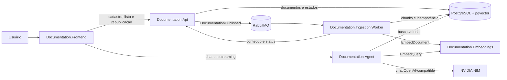
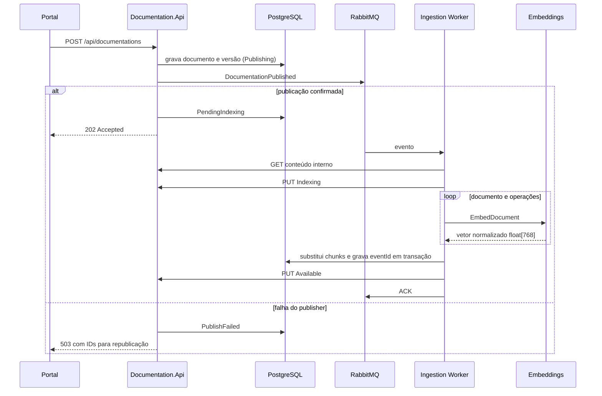
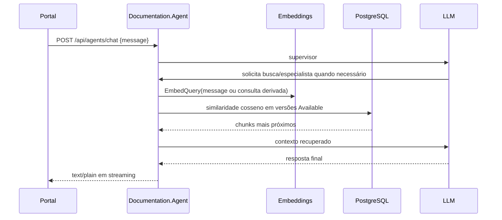
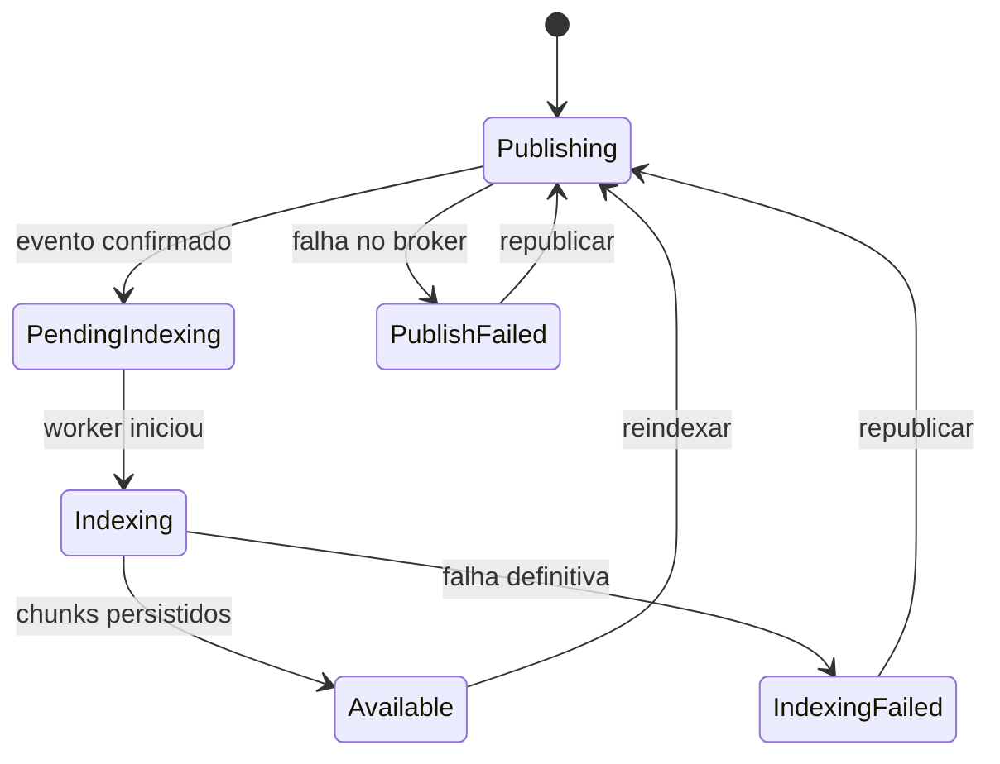

# Especificação geral do Documentation Portal

## 1. Finalidade

Este documento consolida a POC como referência funcional e técnica para a
implementação do sistema definitivo. Ele descreve o comportamento existente,
os limites conhecidos e os requisitos que devem ser confirmados antes da
produção. As especificações de cada sistema detalham seus contratos e decisões.

O produto mantém especificações OpenAPI versionadas, indexa seu conteúdo para
busca semântica e orienta integrações por meio de um agente conversacional.

## 2. Escopo do produto

### Capacidades demonstradas pela POC

1. cadastrar uma documentação OpenAPI em JSON ou YAML;
2. manter versões por API e ambiente;
3. publicar um evento de indexação sem transportar o documento no broker;
4. dividir o OpenAPI em documento completo e operações HTTP;
5. gerar embeddings locais de 768 dimensões;
6. persistir e consultar vetores no PostgreSQL com pgvector;
7. responder perguntas usando recuperação semântica e agentes de IA;
8. acompanhar estados e solicitar novamente uma indexação com falha.

### Fora do escopo atual

- autenticação, autorização, organizações e isolamento entre clientes;
- edição ou exclusão de documentos e versões;
- validação semântica completa do OpenAPI e resolução de `$ref` externos;
- aprovação editorial, auditoria imutável e política de retenção;
- alta disponibilidade, autoscaling, backup e recuperação de desastre;
- garantias de SLA, custo ou qualidade das respostas de IA.

Esses itens não devem ser considerados desnecessários ao sistema definitivo;
eles apenas não foram validados pela POC.

## 3. Visão arquitetural

Há cinco sistemas executáveis e dois grupos de projetos internos
compartilhados:

| Sistema lógico | Projetos/artefatos | Responsabilidade |
| --- | --- | --- |
| Portal web | `Documentation.Frontend` | Administração e chat no navegador. |
| Registro de documentação | `Documentation.Api`, `Documentation.Domain`, `Documentation.Application`, `Documentation.Infrastructure` | Fonte de verdade de documentos, versões e estado da indexação. |
| Ingestão | `Documentation.Ingestion.Worker`, `Documentation.Ingestion.Domain`, `Documentation.Ingestion.Application`, `Documentation.Ingestion.Infrastructure` | Processamento assíncrono, chunking e indexação. |
| Embeddings | `Documentation.Embeddings` | Vetorização local de documentos e consultas por gRPC. |
| Agente | `Documentation.Agent` | Recuperação semântica e orientação de integração em streaming. |
| Contratos | `Documentation.Contracts` | Evento e topologia RabbitMQ compartilhados por API e ingestão. |
| Ambiente local | `compose.yaml`, `infra/postgres`, Dockerfiles | Composição das dependências e serviços da POC. |

Os projetos `.NET` usam `net10.0`. O agente usa Python 3.13 e FastAPI. O
frontend é HTML, CSS e JavaScript nativos servido por Nginx.

## 4. Fluxos ponta a ponta

### 4.1 Publicação e indexação

O evento identifica uma versão imutável. O conteúdo permanece na API e é
obtido pelo worker. Essa decisão reduz o tamanho das mensagens, mas cria uma
dependência síncrona do worker com a API.

### 4.2 Consulta assistida

O chat é stateless: o navegador mostra o histórico, mas cada requisição envia
somente a mensagem atual. Respostas devem ser tratadas como orientação baseada
no conteúdo recuperado, não como fonte autoritativa independente.

## 5. Dados e ownership

Um único PostgreSQL é compartilhado na POC, com separação lógica por schema:

| Schema | Dono | Conteúdo |
| --- | --- | --- |
| `documentation` | Documentation.Api | APIs, versões, OpenAPI original e estados. |
| `ingestion` | Ingestion Worker | Chunks, embeddings e eventos processados. |

O agente possui acesso de leitura aos chunks e ao estado da versão para filtrar
somente conteúdo `Available`. O worker normalmente altera estado pela API; a
rotina de compatibilidade da dimensão vetorial é uma exceção da POC e acopla os
schemas.

Invariantes atuais:

- `apiId` identifica um documento lógico;
- `(documentationId, version, environment)` é único;
- uma versão publicada mantém seu conteúdo original;
- cada chunk pertence a um `documentId` e `versionId`;
- todo embedding persistido tem 768 dimensões e norma aproximada de 1;
- `eventId` processado impede reexecução do mesmo evento;
- a busca utiliza somente versões no estado `Available`.

## 6. Contratos entre sistemas

| Origem | Destino | Contrato |
| --- | --- | --- |
| Frontend | API | HTTP/JSON público em `/api/documentations`. |
| Frontend | Agent | HTTP `POST /api/agents/chat`, resposta `text/plain` progressiva. |
| API | Worker | Evento `DocumentationPublished` via RabbitMQ. |
| Worker | API | HTTP/JSON interno para conteúdo e status. |
| Worker | Embeddings | gRPC `EmbedDocument`. |
| Agent | Embeddings | gRPC `EmbedQuery`. |
| Worker/Agent | PostgreSQL | Npgsql/psycopg e pgvector. |
| Agent | NVIDIA NIM | API OpenAI-compatible. |

`X-Correlation-ID` é propagado em HTTP, RabbitMQ e gRPC quando disponível. O
valor aceito possui 1 a 128 caracteres, inicia por alfanumérico e contém apenas
alfanuméricos, `.`, `_`, `:` ou `-`.

## 7. Estados e recuperação

RabbitMQ usa fila principal, retry com TTL e DLQ. A ingestão confirma
manualmente cada mensagem, limita o prefetch a um e substitui os chunks da
versão em transação. A atualização final do estado pela API ocorre depois do
commit; portanto, indisponibilidade nesse ponto pode exigir reentrega ou
reconciliação.

## 8. Requisitos não funcionais derivados

### Segurança

O sistema definitivo deve:

- autenticar usuários e serviços e autorizar ações por papel e escopo;
- restringir rotas internas à identidade do worker;
- usar TLS em tráfego externo e interno conforme o ambiente;
- manter segredos fora de arquivos versionados;
- limitar tamanho, tipo e conteúdo aceito de documentos;
- impedir que conteúdo indexado ou prompts revelem dados de outro escopo;
- registrar ações administrativas sem armazenar segredos nos logs;
- definir proteção contra prompt injection e saída insegura do agente.

### Confiabilidade e operação

- substituir `EnsureCreated` por migrations versionadas;
- definir estratégia de outbox ou reconciliação entre banco e broker;
- tornar callbacks de estado recuperáveis e observáveis;
- ter readiness/liveness separados e métricas para filas, indexação, banco,
  embeddings, LLM, latência e erros;
- definir backup, restauração, retenção, DLQ e reprocessamento operacional;
- preservar idempotência mesmo com múltiplas réplicas;
- validar limites de timeout, retry e concorrência com carga representativa.

### Qualidade e evolução

- versionar contratos HTTP, eventos e protobuf de maneira compatível;
- registrar modelo, revisão, dimensão e estratégia de chunking usados por cada
  índice, permitindo reindexação controlada;
- avaliar chunking por tokens e resolução de `$ref` com documentos reais;
- medir precisão da recuperação e qualidade das respostas com um conjunto de
  perguntas esperado;
- definir paginação e filtros antes que o catálogo cresça;
- tornar o frontend acessível por teclado e tecnologias assistivas.

## 9. Decisões da POC

### Preservar até evidência contrária

- conteúdo fora do evento e evento contendo somente referência imutável;
- ownership separado entre registro e índice;
- idempotência por `eventId` e substituição atômica dos chunks da versão;
- distinção entre embeddings de consulta e de documento;
- contratos simples e explícitos entre os sistemas;
- correlação ponta a ponta e estados visíveis ao usuário.

### Reavaliar antes da produção

- banco físico compartilhado e acesso SQL direto do Agent;
- endpoint interno HTTP do conteúdo em vez de storage de objetos;
- RabbitMQ e topologia atual diante do volume esperado;
- EmbeddingGemma fp32 em CPU, inferência serial e dimensão fixa em schema;
- provedor/modelos NVIDIA NIM e fallback;
- chat stateless e quantidade fixa de resultados sem filtros do usuário;
- frontend sem framework, adequado à POC mas dependente do escopo definitivo;
- acoplamento da migração vetorial ao schema da API.

## 10. Critérios mínimos para a implementação definitiva

Antes de considerar o produto pronto, validar pelo menos:

1. cadastro, listagem e republicação com autenticação e autorização;
2. indexação idempotente após falhas do broker, API, embeddings e banco;
3. isolamento de dados e busca somente em versões autorizadas e disponíveis;
4. rastreabilidade de uma operação por correlação entre todos os sistemas;
5. migrations, backup/restauração e procedimento de DLQ/reindexação;
6. limites de documento, concorrência, latência e custo definidos por SLO;
7. avaliação reproduzível da busca e da resposta do agente;
8. testes de contrato para HTTP, evento e gRPC;
9. políticas de segurança, privacidade, retenção e auditoria aprovadas;
10. deploy independente, rollback e health checks de cada sistema.

## 11. Índice de especificações

- [Documentation API](documentation-api.md)
- [Ingestão](documentation-ingestion.md)
- [Embeddings](documentation-embeddings.md)
- [Agente](documentation-agent.md)
- [Frontend](documentation-frontend.md)
- [Infraestrutura local](local-infrastructure.md)
- [Contratos compartilhados](repository-contracts.md)

